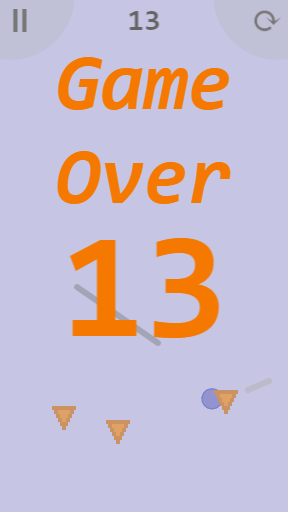

# Firecyclist!
*(c) Wilson Berkow*

Firecyclist is a simple, fun mobile game in which you are a unicyclist struggling to keep from being on
fire, sliding and manuevering on platforms that you create in order to avoid all the
fireballs around you and get the maximum number of points!

### Screenshots

### Todos:
- GRAPICS:
  - Try making the fireball color scheme yellower (e.g. orange --> yellow-orange; red --> yellow-yellow-orange).
  - Try enlarging fireballs even more.
  - Make the unicyclist-graphic that I lost (because  I'm an idiot who did't consistently save) a while ago. It would be a huge improvement on the blue circle. Try to first use basic png, then if that works and is fast, make the graphics. Manual in-elm drawing of the forms I think is slow, and should thus be the last resort.

- GAME LOGIC:
  - Improve fireball-disperion logic. This means not having almost none at some times.
  - Make the intial seed not hardcoded (do Time or something).

- INTERFACE:
  - Make the main-menu "Play" text be an actual button, so only when clicking there (rather
     than anywhere on the screen) one start playing.
  - Make fireballs fall down in the background of the MainMenu.

- FOR SIMPLICITY OR CODE QUALITY:
  - Maybe use types like 'HasVelocity r' and 'HasXY r' and generalize operations like
     applying gravity.

- GAMEPLAY:
  - Coins
  - Targets (fixed at a point on the screen, for a few seconds).
  - Near-death bonus
  - When ball hits Platfm preview, the preview solidifies into an actual Platfm, which the ball then bounces of of.
  - Play with:
    -max length for platforms
    -animation of fireballs
    -USE PHONE ACCLEROMETER FOR MOVING BALL!

- FIX:
  - Ball falling through Platfm due to lower framerate and high precision collision sensitivity.
  - Touches get confused when finger is down while switching between screens.