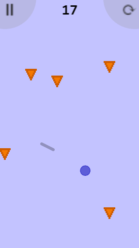
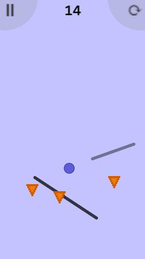

# Firecyclist!
*(c) Wilson Berkow*

Firecyclist is a simple, fun mobile game in which you are a unicyclist struggling to keep from being on
fire, sliding and manuevering on platforms that you create in order to avoid all the
fireballs around you and get the maximum number of points!

### Screenshots

### Todos:
- GRAPICS:
  - Try making the fireball color scheme yellower (e.g. orange --> yellow-orange; red --> yellow-yellow-orange),
     or, even better, make some fireballs randomly have this color scheme and the others have the redder one.
  - Make fireballs rise in the background of the MainMenu.

- INTERFACE:
  - Make the main-menu "Play" text be an actual button, so only when clicking there (rather
     than anywhere on the screen) one start playing.

- FOR SIMPLICITY OR CODE QUALITY:
  - Maybe use types like 'HasVelocity r' and 'HasXY r' and generalize operations like
     applying gravity.

- GAMEPLAY:
  - Near-death bonus
  - Play with animation of fireball